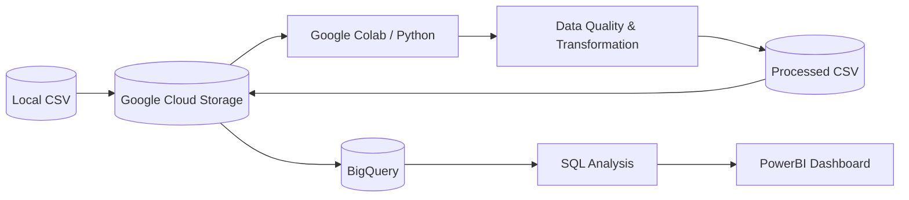

<div align="center">

# Retail Sales ETL Pipeline

<br>

<p>
An end-to-end data engineering pipeline built with Python, Google Cloud Storage, Google Colab, BigQuery, SQL, and PowerBI.
</p>

<br>

<p>
ETL • Data Quality • Cloud Storage • Data Warehouse • SQL Analytics • Dashboarding
</p>

<br>

<p>• • •</p>

<br>

[](https://www.python.org/)
[](https://pandas.pydata.org/)
[](https://cloud.google.com/)
[](https://cloud.google.com/storage)
[](https://cloud.google.com/bigquery)
[](https://www.w3schools.com/sql/)
[](https://powerbi.microsoft.com/)
[](https://github.com/)

<br>

*Designed as a portfolio project to demonstrate practical Data Engineering, data quality, cloud storage, SQL analytics, and data visualization skills.*

</div>

---

## Table of Contents

- [Overview](#overview)
- [Features](#features)
- [Architecture](#architecture)
- [Tech Stack](#tech-stack)
- [Project Structure](#project-structure)
- [Pipeline Workflow](#pipeline-workflow)

---

## Overview

**Retail Sales ETL Pipeline** is a portfolio data engineering project demonstrating an end-to-end workflow for extracting, transforming, and loading retail sales data using Google Cloud and Python.

The pipeline covers the following journey:

1. Upload raw retail sales data from a local system to Google Cloud Storage.
2. Extract the CSV file from Google Cloud Storage into Google Colab.
3. Perform data-quality checks and transformations using Python and Pandas.
4. Generate a cleaned, analysis-ready CSV file.
5. Load the processed dataset back into Google Cloud Storage.
6. Load the processed dataset into BigQuery.
7. Perform business analysis using SQL.
8. Build an interactive dashboard using Looker Studio.

The project focuses on practical data-quality handling, cloud-based data storage, SQL analysis, and visualization of business insights.

---

## Features

- **Cloud Data Ingestion**: Upload raw retail sales data to Google Cloud Storage.
- **Data Extraction**: Extract CSV data from GCS into Google Colab.
- **Data Transformation**: Clean and transform data using Python and Pandas.
- **Data Quality**: Handle missing values, duplicates, inconsistent values, and data types.
- **Processed Data Storage**: Save the transformed dataset as a cleaned CSV and upload it back to GCS.
- **BigQuery Loading**: Load the processed dataset into BigQuery for analytical querying.
- **SQL Analysis**: Analyze sales performance, categories, items, customers, revenue, and volume.
- **Looker Studio Dashboard**: Visualize the analytical results through an interactive dashboard.
- **Version Control**: Maintain project code and documentation using Git and GitHub.

---

## Architecture


---

## Tech Stack

- **Programming:** Python, Pandas
- **Cloud Storage:** Google Cloud Storage
- **Data Warehouse:** Google BigQuery
- **Analytics:** SQL
- **Visualization:** Power BI
- **Development:** Google Colab
- **Version Control:** Git, GitHub

---

## Project Structure

```text
retail-sales-etl-pipeline/
│
├── README.md
├── data/
│   ├── raw/
│   └── processed/
│
├── notebooks/
│   └── retail_sales_etl.ipynb
│
├── sql/
│   ├── category_analysis.sql
│   ├── item_analysis.sql
│   └── customer_analysis.sql
│
└── screenshots/
    └── dashboard.png
```

---

## Pipeline Workflow

1. **Ingest**: Python reads raw CSV files from `/sales/retail_sales.csv`.
2. **Transform**: Data is cleaned, validated, and staged.
3. **Upload**: Staged data is uploaded to GCS bucket.
4. **Load**: The processed data is loaded into Bigquery.
5. **Analyze**: SQL queries analyze sales performance, categories, items, and revenue.
6. **Validation**: Custom data quality tests confirm data accuracy.
7. **Cleanup**: Optionally remove temp data for repeatability.

---
